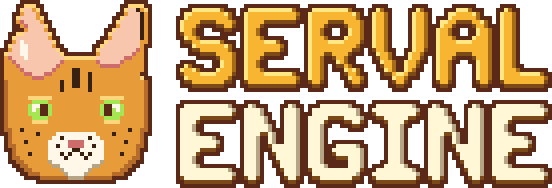

<h1 align="center"></h1>

An open-source Game Boy Advance game runtime written in C on top of [libtonc](https://github.com/gbadev-org/libtonc).

**Website:** [stevengann.com/Serval-Engine](https://stevengann.com/Serval-Engine/), with the docs and an [examples gallery](https://stevengann.com/Serval-Engine/examples/) where every example runs in your browser.

Serval Engine is the code linked into every game ROM built with Studio Advance, the commercial editor, but it is designed to be usable on its own by anyone writing GBA homebrew in C.

It is designed as three layers:

1. **Core API**: a flat, raylib-style C API over libtonc (input, sprites, tilemaps and the camera, sound, text, save data).
2. **World**: a fixed-pool, bitmask ECS for entity data.
3. **Game logic**: GameMaker-style objects and events, run by a compact bytecode VM, written in a statically checked [subset of Lua 5.4](docs/lua.md) compiled ahead of time (the [`fireflies`](examples/fireflies/main.c) example is one script). C stays first-class: a game can be all C against the first two layers, or drop to C for any part.

> **Status:** 1.0.0-rc.1, the release candidate for 1.0: the API is frozen ([what 1.0 promises](docs/api-freeze.md)). Features not built yet are declared as *planned* API: they are in the headers, every use compiles with a warning, they do nothing harmful until a 1.x version implements them, without changing their signatures.

## Features

Implemented in 1.0:

- Frame loop with CPU-cycle timing; buttons with held-button repeat for menus; 24.8 fixed point, integer helpers, trig with `angle_of` (atan2) and `fx_length`, all without division; deterministic random numbers seeded from the player's input.
- Sprites: resident sprite groups, loaded in layers (global and per-room groups with marks), 12 hardware sizes, flips, layers, rotation and scaling (32 shared matrices per frame; per-frame counts of what the hardware limits drop), metasprites (pieces drawn, rotated and depth-sorted as one, about any pivot), depth sorting (cheap with few depths), any palette of the group per draw, hidden and screen-space sprites; animation with per-frame timing and frame sequences with per-step flips; 128 on screen.
- Tilemaps: one tileset per room, up to three layers of 16x16 metatiles on BG1-BG3, streamed around a camera (any map size); parallax, wrapping, fixed and self-scrolling layers; runtime cell changes; animated tiles; four game tag bits per metatile (hazards, water, goals), found under a rectangle with `map_tags_in()`.
- ECS: 128 entities with generational handles; engine components for position, velocity, sprite, animation, body, map body and path; movement, physics, map movement, animation, path and render systems; game-defined components and systems; `ecs_count` and `ecs_gather` for cheap per-kind loops.
- Physics: bouncing bodies (gravity in any direction and per body, bounce up to a perfect one that never loses height, friction, maximum fall speed, open edges, wrap-around, contact reports); map bodies that collide with solid and one-way metatiles; rectangle overlap and hit-side tests.
- Paths: movement patterns as data tables (lines, swoops, circles, weaves), mirrored or rotated per entity.
- Sound on the PSG tone generators: sound effects (tones, envelopes, pitch slides, melodies, priorities) and music (a track per channel, loops, tempo changes, pause and resume, volume, sound effects over it).
- Screen fades (hardware brightness), color mixing (`color_mix()`, matching the hardware's blending) and the backdrop color.
- HUD text (8x8 font) in up to four color styles with a drop shadow, centering, printf-style formatting; a "Made with Serval Engine" splash screen.
- Save data: numbered slots with checksums, version numbers and power-loss-safe writes, on the cartridge's SRAM, Flash (64 or 128 KiB) or EEPROM (8 KiB or 512 bytes), picked per game (`localStorage` in web builds).
- Web builds: any game also builds into one self-contained HTML page (WebAssembly inside) that runs it in a browser on virtual GBA hardware, ready for GitHub Pages or any static host. Keyboard, gamepad and touch input, sound, saves.
- Bytecode VM for GameMaker-style objects and events (Create, Step, Destroy, Collision, Animation End, Room Start): cooperative scripts with waits, entity properties and fields, arrays and engine calls, collisions tested by the VM itself for the pairs a game names (`vm_collide()`), no allocation, hot reload. Game logic in a Lua 5.4 subset, compiled ahead of time by `tools/svlua.py` (tested against real Lua) and assembled by `tools/svm.py`, the blob format's reference assembler and disassembler; `serval_add_script()` runs both at build time.
- Debug builds report API misuse in the emulator log. Tests run natively and on emulated hardware; a benchmark tracks performance. No C library or `malloc` in the ROM.

Planned, declared in 1.0 and implemented in 1.x versions (designed in [`docs/`](docs/README.md); the [full list of names](docs/api-freeze.md#planned-in-1x-declared-now)):

- Sound: tracker music (MOD, S3M, XM, IT) and sampled sound effects, mixed by Maxmod (BlocksDS's), from a sound bank; the PSG wave channel.
- Sprites: streamed groups, LZ77-compressed sprites, runtime sprite tiles, palette writes, alpha-blended sprites.
- Tilemaps: LZ77-compressed tilesets, background palette writes, ladders and floor slopes.
- Screen: alpha blending, raster effects (a scroll offset or backdrop color per scanline).

Later, with no API yet (each can be added without breaking games): palette sharing, tileset groups and 8bpp tilesets, windows and mosaic, dialogue text and larger fonts, tweens, a collision broad phase, the editor debug link, GB/GBC and DS targets.

## Documentation

- [Getting started](docs/getting-started.md): build the examples and write a first game.
- [API reference](docs/api-reference.md): every public function, with units and limits.
- [Documentation index](docs/README.md): design documents, each marked implemented or planned.
- [Development](docs/development.md): tests, source layout, benchmark and release process.

## Examples

| Example | Shows |
| --- | --- |
| [`hello`](examples/hello/main.c) | The smallest game: one sprite moved with the D-pad |
| [`bunnymark`](examples/bunnymark/main.c) | ECS, physics with gravity, depth sorting; doubles as the CPU benchmark |
| [`pong`](examples/pong/main.c) | A complete small game: AI opponent, collisions, effects, sound, splash screen |
| [`asteroids`](examples/asteroids/main.c) | Rotating sprites, wrap-around, many short-lived entities, sound, splash screen, a saved high-score table with initials entry |
| [`breakout`](examples/breakout/main.c) | "Paw Breaker", a brick breaker over four levels: bricks as entities with `body_hit_side`, a constant ball speed, falling power-ups (wide paddle, multi-ball, slow ball, catch, extra life), map layers as backgrounds, fades, music, a saved top-5 table |
| [`platformer`](examples/platformer/main.c) | "Serval Dash", a first level in the classic side-scroller style: scrolling tile maps with parallax, map collision, animated sprites and tiles, blocks hit from below, enemies to stomp, screen fades, music, a goal pole |
| [`shmup`](examples/shmup/main.c) | "Star Veldt", a vertical shoot-'em-up: a stage scrolled by the camera over a parallax starfield, a narrow field with a HUD panel, enemy waves on movement patterns, aimed and spread bullets on an entity budget, power-ups, bombs, a three-phase boss, music, a saved top-5 table |
| [`blackjack`](examples/blackjack/main.c) | Blackjack in a bold, bouncy modern card-game style: cards composed of shared sprite pieces that slide, flip, tilt and wobble, a swirling background, banners, chip and number pops, a swing tune, a bankroll kept in save data |
| [`fireflies`](examples/fireflies/main.c) | A serval catching fireflies at dusk, 60 seconds a round, whose logic is entirely a script in the Lua subset (`fireflies.lua`), compiled to bytecode for the VM at build time: objects with event handlers, waits, spawning, scoring, the timer, the HUD, sound and music; C only loads the blob, names the collision pair the VM tests (`vm_collide()`) and runs the frame loop |

Each example's `main.c` starts by describing what it demonstrates and what you should see and hear. Planned examples, and the engine gaps each would expose, are in [docs/examples-roadmap.md](docs/examples-roadmap.md). `examples/build-all.sh` builds them all into `examples/roms/`, and with Emscripten set up also as web pages into `examples/html/`.

## Building

Requires CMake ≥ 3.25, Ninja, Python 3 and an `arm-none-eabi` GCC ([ARM GNU Toolchain](https://developer.arm.com/downloads/-/arm-gnu-toolchain-downloads) 15.3 is what CI uses). On Linux, `tools/setup-dev.sh` installs all of it, plus mGBA's test runner and Emscripten, at the versions CI uses ([details](docs/development.md#requirements)).

```sh
tools/setup-dev.sh --add-to-shell && . ~/opt/serval-env.sh   # Linux; or install by hand and
                                                             # export ARM_GNU_TOOLCHAIN=/path/to/arm-gnu-toolchain
cmake --preset gba-release
cmake --build --preset gba-release
# -> build/gba-release/examples/hello.gba, bunnymark.gba, pong.gba, asteroids.gba,
#    breakout.gba, platformer.gba, shmup.gba, blackjack.gba, fireflies.gba
```

Open the `.gba` files in mGBA or any GBA emulator. With [Emscripten](https://emscripten.org/) installed, `cmake --preset web-release && cmake --build --preset web-release` builds the same examples as web pages (`build/web-release/examples/*.html`). A game is its own CMake project that adds the engine (a release archive or a checkout) with `add_subdirectory()` and builds its ROM with `serval_add_rom()` (and compiles Lua scripts with `serval_add_script()`); see [docs/getting-started.md](docs/getting-started.md) to make your own game and [docs/development.md](docs/development.md) for tests.

## License

Serval Engine is released under the [MIT License](LICENSE), so it can be linked into any game, including commercial ones. Games must include the engine's copyright notice and libtonc's (and Maxmod's, once the engine links it for tracker music and sampled sound); see [docs/licensing.md](docs/licensing.md).
