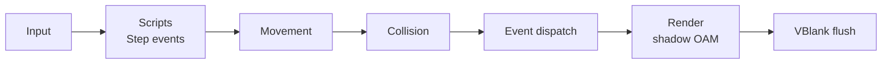

# Frame loop

**Status:** `frame_begin()`, `frame_end()` and the VBlank flush below are implemented, including map streaming, animated tiles and PSG music. The planned order and the rest of the VBlank flush depend on features not built yet (scripts, streamed sprites, shadow palettes, Maxmod).

## What frame_begin and frame_end do today

- `frame_begin()`: starts measuring CPU cycles, polls the buttons, feeds them to `random_entropy()`'s input history and to held-button repeat (`button_repeat()`), and empties the sprite draw list and the rotation matrices.
- Between them, the game updates and draws. The examples use this order: input, `sys_path()`, `sys_movement()` (and `sys_map_movement()` for map bodies), `sys_physics()`, game systems and collision checks, `camera_set()`, `sys_animate()`, `sys_render()` (or `sys_render_by_depth()`), HUD text.
- `frame_end()`: hides unused sprite slots, brings the map layers' screenblock copies up to date with the camera (once a map layer has been loaded; [tilemaps.md](tilemaps.md#streaming)), records the frame's CPU cycles (`frame_cpu_cycles()`, which includes that map work), waits for VBlank, copies the shadow OAM (with the rotation matrices) to hardware, copies queued animated tiles and the changed map rows and columns to VRAM and sets the background registers, then steps PSG sound effects and music (music on the channels no sound effect holds) and counts the frame.

## Planned order

**Status:** planned. Proposed per-frame order once scripts and events exist. This is **not yet confirmed** and should be settled early, since it shapes how games feel.

## VBlank flush

**Implemented:** `frame_end()` waits for VBlank (`VBlankIntrWait`, with the VBlank interrupt enabled but no handler of the engine's), then copies the shadow OAM, including the rotation matrices, to hardware, copies tileset tiles queued by `tileset_set_tiles()` and the map rows and columns that changed (prepared before the wait) to VRAM and sets the map backgrounds' scroll and control registers, and steps the PSG sound effects and music. A full redraw of three map layers takes about 14,500 of VBlank's 83,776 cycles; a new row and column on each, about 3,650. Not deferred to VBlank: `sprite_group_load()`, `tileset_load()`, `map_load()`, `screen_set_backdrop()` and the text calls write VRAM and palette RAM immediately, and `screen_set_brightness()` the blend registers.

**Planned** additions, in `frame_end()` or the VBlank interrupt:

- Copy shadow palettes to hardware ([sprites.md](sprites.md#palettes)).
- Stream sprite frames into their VRAM slots ([sprites.md](sprites.md)).
- Run Maxmod's `mmVBlank()` from the VBlank interrupt, and `mmFrame()` once per game frame ([audio.md](audio.md)).
