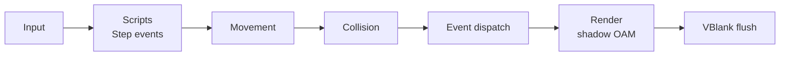

# Frame loop

Proposed per-frame order. This is **not yet confirmed** and should be settled early, since it shapes how games feel.

## VBlank flush

Performed in `frame_end()` ([core-api.md](core-api.md)) and the VBlank interrupt:

- Copy shadow OAM and shadow palettes to hardware.
- Write queued tilemap columns and rows ([tilemaps.md](tilemaps.md#streaming)).
- Stream sprite frames into their VRAM slots ([sprites.md](sprites.md)).
- Swap animated tile graphics.
- Run `mmVBlank()` from the VBlank interrupt.

`mmFrame()` runs once per game frame ([audio.md](audio.md)).
