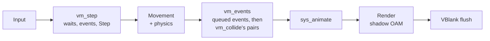

# Frame loop

**Status:** `frame_begin()` and `frame_end()` are implemented, with the implemented part of the VBlank flush: OAM and the rotation matrices, streamed sprite frames, runtime sprite tiles, palette writes, animated tiles, map streaming and the background registers, the blend registers, raster effects, then PSG sound effects and music. The [frame order with scripts](#frame-order-with-scripts) is confirmed: the VM implements it, collision pass included. The rest of the [VBlank flush](#vblank-flush) belongs to planned API, declared in 1.0 and implemented in 1.x versions ([api-freeze.md](api-freeze.md#planned-in-1x-declared-now)): Maxmod's mixer.

## What frame_begin and frame_end do today

- `frame_begin()`: starts measuring CPU cycles, polls the buttons, feeds them to `random_entropy()`'s input history and to held-button repeat (`button_repeat()`), and empties the sprite draw list and the rotation matrices.
- Between them, the game updates and draws. The examples use this order: input, `sys_path()`, `sys_movement()` (and `sys_map_movement()` for map bodies), `sys_physics()`, game systems and collision checks, `camera_set()`, `sys_animate()`, `sys_render()` (or `sys_render_by_depth()`), HUD text.
- `frame_end()`: records the frame's sprite counts for `sprite_stats()` (and counts sprites per scanline, if `sprite_stats_scanlines(true)` asked for it), hides unused sprite slots, prepares a raster effect's values for the next frame (once one has been set; [runtime-systems.md](runtime-systems.md#raster-effects)), brings the map layers' screenblock copies up to date with the camera (once a map layer has been loaded; [tilemaps.md](tilemaps.md#streaming)), records the frame's CPU cycles (`frame_cpu_cycles()`, which includes that map work), waits for VBlank, copies the shadow OAM (with the rotation matrices) to hardware, copies the frames newly drawn from streamed sprite groups to their slots, copies the sprite frames `sprite_set_tiles()` queued, copies the palette banks written this frame to palette RAM, copies queued animated tiles and the changed map rows and columns to VRAM and sets the background registers, writes a raster effect's line 0 value and restarts DMA 0 on the others, then steps PSG sound effects and music (music on the channels no sound effect holds) and counts the frame.

## Frame order with scripts

**Status:** confirmed: `vm_step()` and `vm_events()` implement it ([vm.md](vm.md#scheduling-two-phases-per-frame)). The VM runs in two phases, so collision handlers run the same frame as the collision, after movement (GameMaker's feel). `vm_events()` first runs the events game code queued since `vm_step()`, then tests the collision pairs the game set with `vm_collide()`, running each overlap's Collision reactions as it finds it ([vm.md](vm.md#collisions)):

An animation that `sys_animate` finishes raises Animation End in the next frame's `vm_step` (the VM checks `anim_finished()` for entities with a handler; [vm.md](vm.md#exact-semantics)).

## VBlank flush

`frame_end()` prepares what it can before the wait, as CPU work of the frame: the per-line values of a raster effect's table, in a buffer in EWRAM ([runtime-systems.md](runtime-systems.md#raster-effects)), first, since they tell the map streaming which layer pixels the lines show, then the map layers' screenblock copies in EWRAM ([tilemaps.md](tilemaps.md#streaming)). It then waits for VBlank (`VBlankIntrWait`, with the VBlank interrupt enabled, and no handler of the engine's but raster effects', below) and writes VRAM, palette RAM, OAM and the display registers in this order. Items marked *planned* belong to planned API and are not done yet: today nothing they would copy exists (their calls are stubs that change nothing), so the order is fixed now for when they are implemented.

1. **OAM and the rotation matrices** (implemented): the 128-entry shadow OAM, whose otherwise unused fourth halfwords hold the 32 matrices, copied whole.
2. **Streamed sprite frames** (implemented, `SPRITE_GROUP_STREAMED`): each frame newly drawn from a streamed group, copied from ROM to its slot, in the same VBlank as the OAM that shows it: about 56 cycles per tile, 3,550 for a 64x64 frame; about 70 when no frame is new ([sprites.md](sprites.md#residency-modes)).
3. **`sprite_set_tiles()` copies** (implemented): the queued frames, up to `SPRITE_MAX_TILE_UPDATES`, about 75 cycles a tile from EWRAM; with none queued, a test of a counter ([sprites.md](sprites.md#runtime-tiles)).
4. **`tileset_set_tiles()` copies** (implemented): the queued animated tiles, up to `MAP_MAX_TILE_UPDATES` ([tilemaps.md](tilemaps.md#tilesets)).
5. **Dirty shadow-palette banks** (implemented): the palette banks written by `sprite_set_colors()` and `tileset_set_colors()` since the last frame, copied from the engine's shadow palette to palette RAM, about 140 cycles per bank ([sprites.md](sprites.md#palettes), [tilemaps.md](tilemaps.md#palette-writes)). Done just before step 4's copies, which share one call into the map code with step 6; the two write different memory, so which goes first changes nothing on screen. A flag test when nothing was written, and nothing at all in a game that never writes colors.
6. **Map rows and columns, and the background registers** (implemented): for each of backgrounds 1-3, its control register and display bit (when a layer was loaded or unloaded), its scroll registers, then the screenblock rows and columns that changed. A full redraw of three map layers takes about 22,600 of VBlank's 83,776 cycles; a new row and column on each, about 3,960 ([tilemaps.md](tilemaps.md#streaming)).
7. **Blend and raster registers**: `screen_set_blend()`'s settings, if it was called since the last flush: `BLDALPHA`, and `BLDCNT` while the brightness is 0 and the splash isn't running (`serval_blend_apply()`, `src/gba/blend.c`; [runtime-systems.md](runtime-systems.md#alpha-blending)); then, for a raster effect, line 0's value, written over the scroll register step 6 set (or the backdrop step 5 may have), and DMA 0 restarted on the prepared per-line values; when an effect ends, DMA 0 stops and, after `raster_backdrop()`, the backdrop gets its one color back, the one last set ([runtime-systems.md](runtime-systems.md#raster-effects)). The raster part takes about 300 cycles.
8. **Sound, once per VBlank:** the PSG step, sound effects then music (implemented), then Maxmod's `mmFrame()` (*planned*), which runs the tracker player and mixes the next VBlank's samples ([audio.md](audio.md#frame-loop)).

**The VBlank interrupt:** while a raster effect is on, the engine's VBlank handler restarts DMA 0 at every VBlank, so a frame that overruns into a second VBlank shows the effect again (step 7 restarts it too, on the new values). Maxmod's `mmVBlank()` will run first in the engine's VBlank handler, uninterrupted (*planned*, [audio.md](audio.md#hardware-it-claims)). How a frame that overruns into a second VBlank keeps the mixer fed, and how the mixer's time is reported (it runs after `frame_cpu_cycles()` stops counting), are settled with that implementation ([audio.md](audio.md#frame-loop)).

**Not deferred to VBlank:** `sprite_group_load()`, `tileset_load()`, `map_load()`, `screen_set_backdrop()` (only remembered while `raster_backdrop()` is on) and the text calls write VRAM and palette RAM immediately, and `screen_set_brightness()` the blend registers. A palette write made earlier in the frame gives way to the colors they write, as if both had waited for VBlank.
