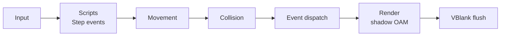

# Frame loop

## What frame_begin and frame_end do today

- `frame_begin()`: starts measuring CPU cycles, polls the buttons, and empties the sprite draw list and the rotation matrices.
- Between them, the game updates and draws. The examples use this order: input, `sys_movement()`, `sys_physics()`, game systems and collision checks, `sys_render()` (or `sys_render_by_depth()`), HUD text.
- `frame_end()`: hides unused sprite slots, records the frame's CPU cycles (`frame_cpu_cycles()`), waits for VBlank, copies the shadow OAM (with the rotation matrices) to hardware, and advances PSG sound effects.

## Planned order

Proposed per-frame order once scripts and events exist. This is **not yet confirmed** and should be settled early, since it shapes how games feel.

## VBlank flush

Performed in `frame_end()` ([core-api.md](core-api.md)) and the VBlank interrupt:

- Copy shadow OAM and shadow palettes to hardware.
- Write queued tilemap columns and rows ([tilemaps.md](tilemaps.md#streaming)).
- Stream sprite frames into their VRAM slots ([sprites.md](sprites.md)).
- Swap animated tile graphics.
- Run `mmVBlank()` from the VBlank interrupt.

`mmFrame()` runs once per game frame ([audio.md](audio.md)).
