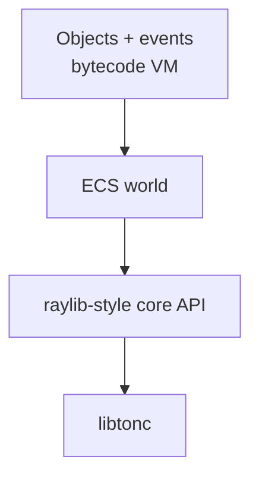

# Overview

## Purpose

Serval Engine is the GBA-side runtime for Studio Advance, a cross-platform editor for building Game Boy Advance games without writing code. Every ROM the editor exports links this engine. Advanced users can write C against the same API directly.

The engine is open source; the editor is a separate, closed-source product. See [Relationship to Studio Advance](#relationship-to-studio-advance).

**Status:** design overview, at 1.0.0-rc.1: the API is frozen, with unfinished features declared as planned API ([what 1.0 means](#what-10-means)). The core API and the ECS world are implemented; so is the game-logic layer (objects, events and the bytecode VM, with game logic written in a [Lua subset](lua.md) compiled to it); C stays first-class. The [layers table](#layers) has the details.

## Design inspirations

- **raylib:** a flat, simple C API with no hidden objects.
- **ECS:** data-oriented entity storage in fixed pools.
- **GameMaker:** objects with events, rooms, and grouped assets.

## Layers

| Layer | Borrowed from | Role | Status | Doc |
| --- | --- | --- | --- | --- |
| Core API | raylib | Flat C calls over libtonc: input, drawing, sound, saves | Implemented (sprites, tilemaps and the camera, PSG sound effects and music, text, fades, color mixing, save data); declared as planned API: tracker music and sampled sound (Maxmod), the PSG wave channel, streamed and LZ77 sprites, LZ77 tilesets, palette writes, ladders and slopes, alpha blending, raster effects | [core-api.md](core-api.md) |
| World | ECS | Fixed-pool entity storage and per-frame bulk processing: movement, physics, map collision, animation, paths, rendering | Implemented | [ecs.md](ecs.md) |
| Game logic | GameMaker | Objects with events, executed by the bytecode VM | Interpreter, scheduler, engine bridge, the collision pass (`vm_collide`) and the [Lua-subset](lua.md) compiler implemented, with `fireflies` written in it; the debug link planned; C stays first-class | [vm.md](vm.md) |

## Guiding principle: precompute everything

The tooling does the heavy lifting (sprite packing, tile deduplication, palette assignment, script compilation) so the runtime only executes lean, precomputed data read directly from memory-mapped ROM. When a choice exists between runtime work and build-time work, prefer build time.

## What 1.0 means

1.0 freezes the API, and the API is complete in 1.0, not finished ([api-freeze.md](api-freeze.md#what-10-promises)). 1.0.0-rc.1 is the release candidate, which Studio Advance integrates against; 1.0.0 follows. From 1.0.0 on, breaking changes need a major version, and adding is a minor version ([releases.md](releases.md#versioning)).

- **Implemented in 1.0** (each doc's status line has the details; the [README](../README.md#features) has the summary): regular tiled backgrounds with a camera and map collision, resident sprites and metasprites, the ECS with physics, paths and animation, PSG sound effects and music, save data, HUD text, brightness fades and color mixing, the bytecode VM with its collision pass, the Lua-subset compiler, and the web target.
- **Declared in 1.0, implemented in 1.x minor versions** (planned API: in the headers, warned about at every use, doing nothing harmful until then; [api-freeze.md](api-freeze.md#planned-in-1x-declared-now)): tracker music and sampled sound effects through Maxmod, the PSG wave channel, streamed sprite groups, LZ77-compressed sprites and tilesets, palette writes, ladders and floor slopes, alpha blending and raster effects. Runtime sprite tiles, declared the same way, are implemented ([sprites.md](sprites.md#runtime-tiles)).
- **Not declared in 1.0** (no API, no schedule; each can still be added later without breaking games, [api-freeze.md](api-freeze.md#later-additively-no-api-now)): Mode 7 / affine backgrounds, GB/GBC and DS targets, streamed PCM audio, link cable multiplayer, windows and mosaic, dialogue text and variable-width fonts, and the debug link, whose protocol is still to be defined ([debug-link.md](debug-link.md)).

## Relationship to Studio Advance

- Studio Advance (closed source, sibling repo `../Studio-Advance`) uses this engine, but the two are versioned independently: each game project picks an engine release, which the editor downloads from this repository's GitHub Releases ([releases.md](releases.md)). This engine must never depend on Studio Advance.
- Studio Advance's build pipeline emits generated C (constant asset tables and bytecode) that conforms to the data formats defined here, then compiles it together with the engine.
- The editor's packing, deduplication and palette algorithms are not part of this repository. The engine only defines the formats they produce.
- The debug link protocol is a shared contract: this repo defines the runtime side ([debug-link.md](debug-link.md)).
