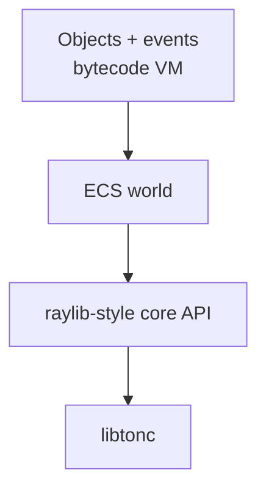

# Overview

## Purpose

Serval Engine is the GBA-side runtime for Studio Advance, a cross-platform editor for building Game Boy Advance games without writing code. Every ROM the editor exports links this engine. Advanced users can write C against the same API directly.

The engine is open source; the editor is a separate, closed-source product. See [Relationship to Studio Advance](#relationship-to-studio-advance).

**Status:** design overview. The core API and the ECS world are implemented; the game-logic layer (objects, events and the bytecode VM) is planned, so games are written in C today. The [layers table](#layers) has the details.

## Design inspirations

- **raylib:** a flat, simple C API with no hidden objects.
- **ECS:** data-oriented entity storage in fixed pools.
- **GameMaker:** objects with events, rooms, and grouped assets.

## Layers

| Layer | Borrowed from | Role | Status | Doc |
| --- | --- | --- | --- | --- |
| Core API | raylib | Flat C calls over libtonc: input, drawing, sound, saves | Implemented (sprites, tilemaps and the camera, PSG sound effects and music, text, fades, save data); Maxmod audio, palette management and more effects planned | [core-api.md](core-api.md) |
| World | ECS | Fixed-pool entity storage and per-frame bulk processing: movement, physics, map collision, animation, paths, rendering | Implemented | [ecs.md](ecs.md) |
| Game logic | GameMaker | Objects with events, executed by the bytecode VM | Planned; games are written in C today | [vm.md](vm.md) |

## Guiding principle: precompute everything

The tooling does the heavy lifting (sprite packing, tile deduplication, palette assignment, script compilation) so the runtime only executes lean, precomputed data read directly from memory-mapped ROM. When a choice exists between runtime work and build-time work, prefer build time.

## 1.0 scope

In scope (see each doc's status line for what exists today; the [README](../README.md#features) has the summary): regular tiled backgrounds, sprites (resident and streamed), the ECS, the bytecode VM, Maxmod audio plus PSG SFX, save data, text, special effects, camera, and the debug link hooks.

**Not in 1.0:** Mode 7 / affine backgrounds, GB/GBC and DS targets, streamed PCM audio, link cable multiplayer. Raster effects are a 1.0 candidate if time allows.

## Relationship to Studio Advance

- Studio Advance (closed source, sibling repo `../Studio-Advance`) uses this engine, but the two are versioned independently: each game project picks an engine release, which the editor downloads from this repository's GitHub Releases ([releases.md](releases.md)). This engine must never depend on Studio Advance.
- Studio Advance's build pipeline emits generated C (constant asset tables and bytecode) that conforms to the data formats defined here, then compiles it together with the engine.
- The editor's packing, deduplication and palette algorithms are not part of this repository. The engine only defines the formats they produce.
- The debug link protocol is a shared contract: this repo defines the runtime side ([debug-link.md](debug-link.md)).
